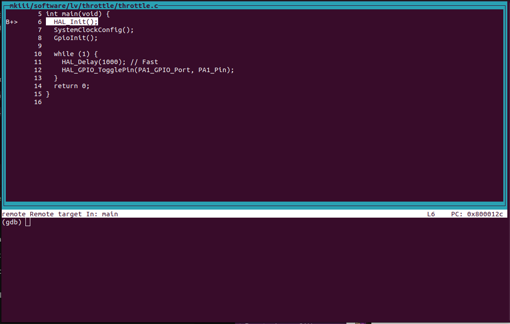

<h1 align="center">
	
</h1>

Welcome to the Olin Electric Motorsports monorepo. This is the home for all of our
electrical, firmware, and software work.

This document will help you get started contributing and walk you through
important steps for collaborating with teammates.

## Getting Started

### Prerequisites
Download the following
   - [Bazel](https://bazel.build/install) (Bazelisk is recommended but not needed)
   - OpenOCD: 

for Ubuntu/Linux:
```Shell
sudo apt install openocd
```

Once you have those downloaded and installed, you should be able to build and flash the firmware.

Now we need to set up some of the KiCad Git filters (a set of rules that remove temp files that cause clutter):
```shell
cd oem-monorepo/
./scripts/startup/install_kicad_git_filters.sh
```
You'll also want to have the KiCad Git Hooks to generate our symbol libraries. These hooks run every time you push or pull and allow multiple users to add symbols/footprints to our KiCAD library.

```shell
./scripts/startup/install_kicad_git_hooks.sh
```
### Testing to see if things are installed

You can test if Bazel is installed correctly by running:
```Shell
bazel version
```
You should see the version of Bazel printed in the terminal.

To test if OpenOCD is installed, you can run:
```Shell
openocd --version
```
This should also print the version of OpenOCD.

Then run 
```Shell
bazel build //...
```
If that works yayay!!!

Now run
```Shell
bazel build //vehicle/... --config=m4
```

There should be a lot of green becasue it all worked first try

## Building the Firmware

#### To build:
 specific targets, you can use:

```Shell
bazel build --config=m4 //mkiii/software/lv/throttle:throttle.elf
```
This creates the .elf file inside the `bazel-bin` directory.

#### To flash:
specific target using ST-Link run:
```Shell
bazel run --config=m4 //mkiii/software/lv/throttle:throttle_flash
```

#### To debug:
using OpenOCD's debugging tool run:
```Shell
bazel run -c dbg --config=m4 //mkiii/software/lv/throttle:throttle_debug
```
v
## Basic debugging with OpenOCD

OpenOCD and GDB are the primary tools and can be used together for debugging STM32 applications. OpenOCD provides the interface to the hardware, while GDB is used to inspect and control the execution of the program.

The debug screen should look like this:



After the debug session is started, you can use GDB commands to control the execution of your program, set breakpoints, and inspect variables.

Here are some common GDB commands:

- `break <function>` or `b <function>`: Set a breakpoint at the specified function.
- `continue` or `c`: Resume program execution until the next breakpoint.
- `next` or `n`: Execute the next line of code, stepping over functions.
- `step` or `s`: Execute the next line of code, stepping into functions.
- `finish` or `fin`: Continue execution until the current function returns.
- `print <variable>`: Print the value of the specified variable.
- `display <var>`: Automatically display the value of a variable each time the program stops.
- `undisplay <id_number>`: Stop displaying the value of a variable.
- `p/x <variable>`: Print the value of a variable in hexadecimal format.
- `info locals`: Print the values of all local variables in the current stack frame.
- `set <var> <variable_name> = <value>`: force the value of a variable.

If you want to detach from the chip and leave the OpenOCD session, you can use the `detach` command in GDB. Then type `exit` to close the GDB session.
